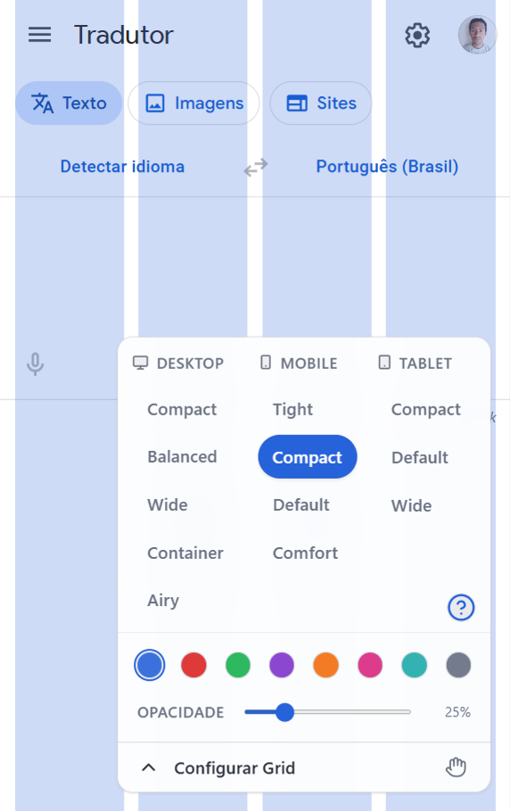

# Layout Column Ruler Web Extension

<div style="display: flex;">
  
</div>

## Baixar a extensão

### Pré-requisitos

- Node.js (v18 ou superior)
- npm (ou yarn/pnpm)

### No terminal do seu computador:

1. Clone o repositório e navegue até a pasta do projeto:

   ```bash
   git clone https://github.com/LeonardoSouzaBento/Layout_Column_Ruler-web_extension
   cd Layout_Column_Ruler-web_extension
   ```

2. Instale as dependências:

   ```bash
   npm install
   ```

3. Execute o build:
   ```bash
   npm run build
   ```

### Instalação da extensão no navegador

1 - Abra o seu navegador (Brave, Chrome ou Edge).

2 - Vá para a página de extensões digitando na barra de endereço: chrome://extensions

3 - Ative o Modo do desenvolvedor (chave seletora no canto superior direito).

4 - Clique no botão Carregar sem compactação (ou Load unpacked).

5 - Na janela que abrir, navegue até a pasta do seu projeto, entre em .output e selecione a pasta chrome-mv3.

## License

[MIT](LICENSE)
